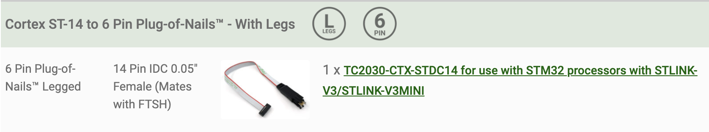

# Boosted ReVOLT! Dashboard

More information about the Boosted ReVOLT! Dashboard on [michael-castiau.blogspot.com](https://michael-castiau.blogspot.com/2021/05/boosted-rev-custom-dashboard-vesc.html)

This repository only contains the executable binairies of the Boosted ReVOLT! Dashboard in `.bin` format. To update your Boosted ReVOLT! dashboard firmware, please refer to the [ReVOLT! Desktop Tool](https://github.com/MichaelCastiau/boosted-revolt-tool) that will update your dashboard automatically.

The binairies can be found in the releases of this repository.

## Flashing Your Dashboard Manually

The dashboard includes a Tag-Connect 6-pin ARM headless connector.
To update your dashboard manually, please refer to the STLink (V2/V3) SWD debugger solutions of Tag-Connect:

### [SWD Solution ARM20-CTX](https://www.tag-connect.com/debugger-cable-selection-installation-instructions/st-link-v2) 

> See "SWD Solution using ARM20-CTX"

### [SWD STDC14 Connector](https://www.tag-connect.com/debugger-cable-selection-installation-instructions/stlink-v3mini)

> See "SWD using the Cortex STDC14 connector with 6 Pin connector on target board"

Both solutions are compatible with the STM32L4 microcontroller present on the board. However, the V3 version of the STLink features ST's most recent product updates.

To flash the firmware, please use the official [ST Program Tool](https://www.st.com/en/development-tools/stm32cubeprog.html)
