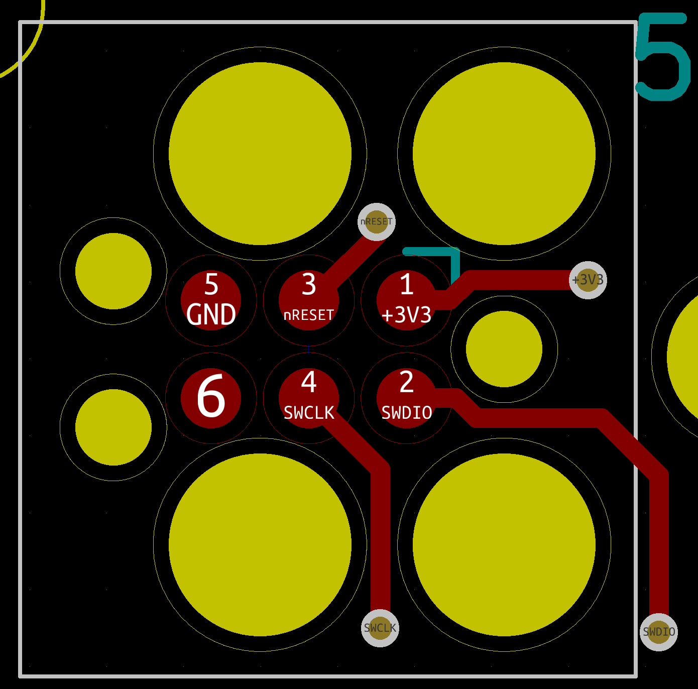

# Boosted ReVOLT! Dashboard

More information about the Boosted ReVOLT! Dashboard on [michael-castiau.blogspot.com](https://michael-castiau.blogspot.com/2021/05/boosted-rev-custom-dashboard-vesc.html)

This repository only contains the executable binairies of the Boosted ReVOLT! Dashboard in `.bin` format. To update your Boosted ReVOLT! dashboard firmware, please refer to the [ReVOLT! Desktop Tool](https://github.com/MichaelCastiau/boosted-revolt-tool) that will update your dashboard automatically.

The binairies can be found in the releases of this repository.

## Flashing Your Dashboard

**For first generation dashboards, we encourage soldering the programmer wires manually, using an STLink V2 for flashing the software**

To update your dashboard manually, you'll need
- An STLink debugger/programmer
- A Tag-connect 6 pin ARM adapter ([tag-connect.com](https://tag-connect.com)) (or solder the wires manually)

Instead of a tag-connect wire, you may solder the wire connections needed. The board contains a 6-pin ARM connector
for programming. (See screenshot for pinout)

### Tag Connect Wire

You may use one of the following wires:
- [2.56mm pitch adapter](https://www.tag-connect.com/product/tc2030-pkt-swd-6-pin-cable-with-legs-for-microchip-pickit-4-snap-sam)
- [6-pin to ARM adapter](https://www.tag-connect.com/product/tc2030-ctx-6-pin-cable-for-arm-cortex)

### STLink

You may use any of the STLink (or clones) to program the firmware update for your dashboard.
STLink V2 and V3 is supported.

